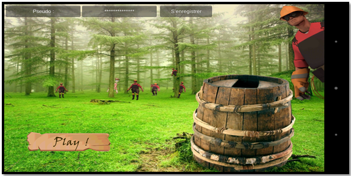
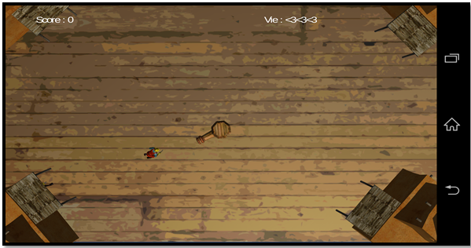
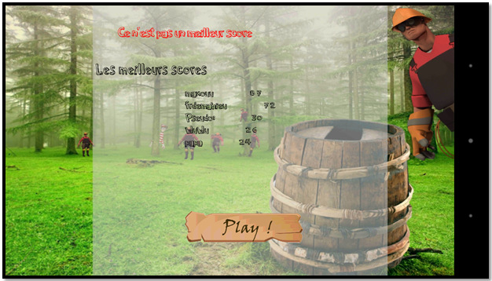
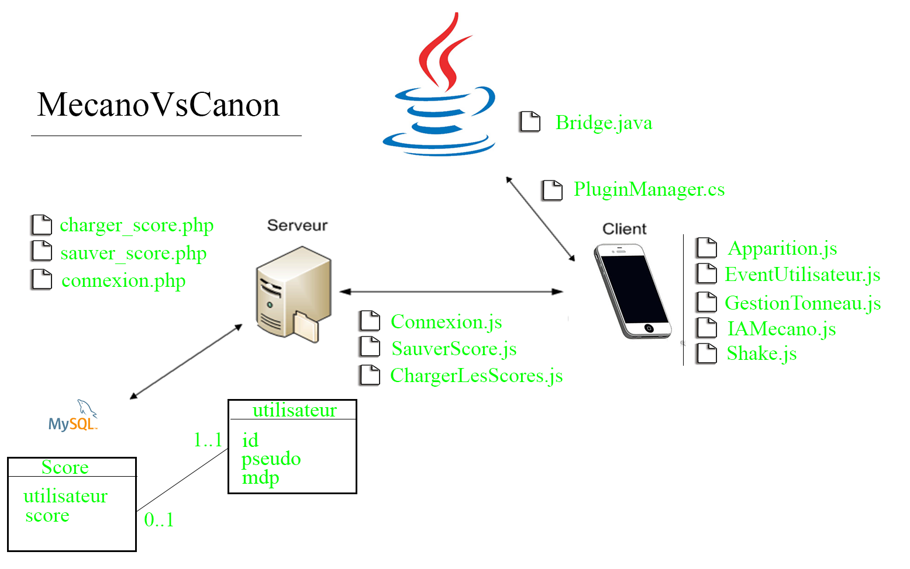

# MecanoVsCanon
This is a 3D project for android made with Unity3D

## Tip

	Pour directement jouer, vous pouvez lancer le jeu.unity directement.

	
## Manuel d’utilisation du jeu sur android

Tout d’abord, vous arrivez sur cette page : 

Pour commencer, vous devez vous inscrire en rentrant vos données dans les champs en haut. 
Si vous n’êtes pas connecté, un popup vous demandera si vous voulez vous connecter en wifi. 
Une fois connecté, un message devrait apparaître disant que vous êtes connecté.
Lorsque vous appuyer sur le bouton play, le jeu se lance :  
Le but du jeu est simple, des mécanos viennent vers vous et vous devez en tuer un maximum. Chaque fois qu’un mécano vous touche, vous perdez une de vos trois vies. Vous pouvez secouer pour mettre en pause le jeu. Lorsque vous perdez vos trois vies, vous accédez à la page des scores : 
 

 
Sur cette page, les  cinq premiers scores vont s’afficher ainsi que votre score. 
Il est possible de rejouer en appuyant sur le bouton jouer.

## Architecture du projet

